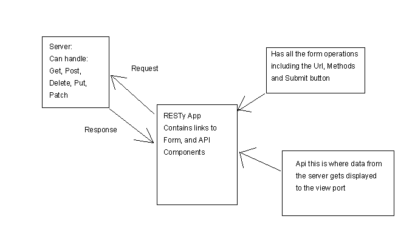

# RESTyPt1

## Project Name 
The first Resty lab

### Author: Student/Group Name: Ed

### Links and Resources
* [Resty](https://codesandbox.io/s/ancient-dawn-3o2nj)

### You will need

* A functional back end that can do full CRUD operations:
  I would recomond: 
* [Backend](https://github.com/mwilkin-401-advanced-javascript/lab-07-api-server) 

#### UML

